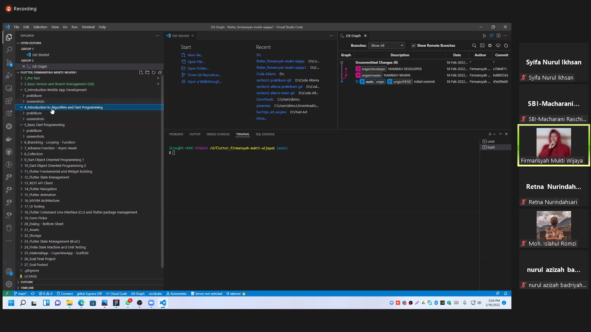

Nama : Macharani Raschintasofi
Kelas : D

3 Point yang dipelajari dari materi Section 2

1. Pengertian GIT
   Merupakan salah satu version control system popular yang digunakan para developer untuk mengembangkan software secara bersama-sama . GIT dapat memantau perubahan file pada semua perubahan yang terjadi pada file tersebut , GIT dapat diinstall dalam OS Apple , Windows , Linux

2. Instalasi GIT pada Windows
   -Searching " Git Download"
   -Klik Download Git-SCM , dan pilih os yang digunakan
   -Tunggu instalasi
   -Setelah selesai , klik file .exe nya
   -Klik next dan pilih lokasi penyimpanan , dan next
   -Pilih komponen yang akan diinstall
   -Next kemudian pilih penyimpanan yang diinginkan
   -(ikuti kotak biru ,centang jika perlu)
   -instalasi berlangsung ~selesai~

   untuk cek versi (buka di gitbash atau cmd)
   $git --version

3. Keyword
   Commit = mencatat perubahan
   Config = melakukan setting up
   Clone = melakukan proses cloning
   Add . = memasukan semua file perubahan kedalam commitnya
   Diff = menampilkan perubahan
   Stash = menyimpan semua kode yang belum diselesaikan untuk di commit
   .Gitignore = memfilter mana library yang boleh dimasukan ke repository mana yang tidak
   Log --oneline = menampilkan setiap commit yang telah dilakukan
   Checkout _nama_ = kembali ke commit sebelumnya atau yang dituju , atau untuk pindah branch/versi

TASK PRATIKUM

Pada task ini , diminta peserta didik untuk membuat sebuah repository pada GitHub yang mengimplementasikan penggunaan branching , intuksi push , pull ,stash,dan merge ,penanganan conflict di branch development serta penggunSSaan merge no fast forwrd

Adapun hasil dari pratikum ini :

